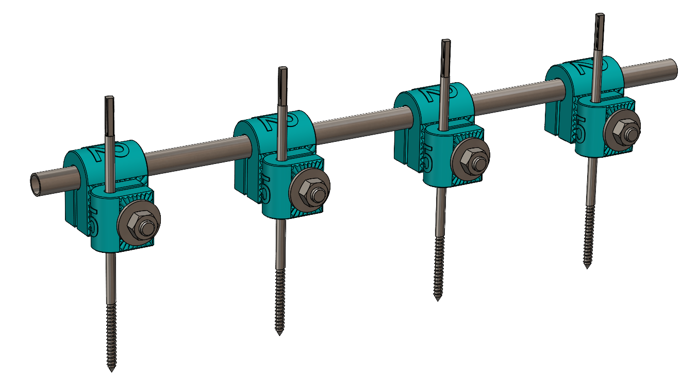

# iFix_3D: 3D Printed External Fixator
## Overview
**iFix_3D** is a novel 3D printed external fixator device developed at Imperial College London. This project is intended for **research purposes only** and is currently **not for clinical use.** The iFix_3D is under continuous development and refinement.

## Status and Disclaimer
- **Development Stage:** Prototype phase; subject to further design and testing.
- **Clinical Use:** Strictly prohibited. The device is for research, academic, and educational purposes only.
- **Licensing:** This model is **not open source**. It is not permitted to build derivative models based on iFix_3D or its features and make them publicly available.

## Features
- **CAD Design:** Developed in SolidWorks.
- **Testing:** Subjected to preliminary Finite Element Analysis (FEA) and mechanical testing at Imperial College London.
- **Adaptability:** Initially designed for lower limb applications but can be adapted for upper limb use via parametric modelling of rod and pin sizes.
- **Assembly:** Simple and inspired by commercial external fixators, modelled after the metal [Imperial External Fixator](https://imperial.ac.uk/external-fixator).

## 3D Printing Information
- **Material Selection:** Choice of 3D printing material depends on local material availability and printer compatibility.
  - Initial prototypes were printed using **PLA** material and a **Prusa i3 MK3S printer**.
  - Materials and printer models may change as testing progresses.

## Repository Contents
- **SolidWorks Files:** Source CAD files for iFix_3D components.
- **Mechanical Testing Data:** Initial test results and protocols (if included).
- **Assembly Instructions:** Step-by-step guide for assembling the fixator.

## Usage Guidelines
- For research and educational usage only.
- Not certified or tested for human or animal clinical procedures.
- Do not attempt to modify, distribute, or publish derivative works based on iFix_3D designs.

## Contact & Acknowledgement
Developed by the research team in the Department of Bioengineering at Imperial College London.

Many thanks to all the researchers who have been involved in this project:  
[Dr Mehdi Saeidi](https://profiles.imperial.ac.uk/m.saeidi), [Dr Angus Clark](https://profiles.imperial.ac.uk/a.clark17), [Prof Anthony Bull](https://profiles.imperial.ac.uk/a.bull), Jenny Shang, and Kyung-Hoon Moon
